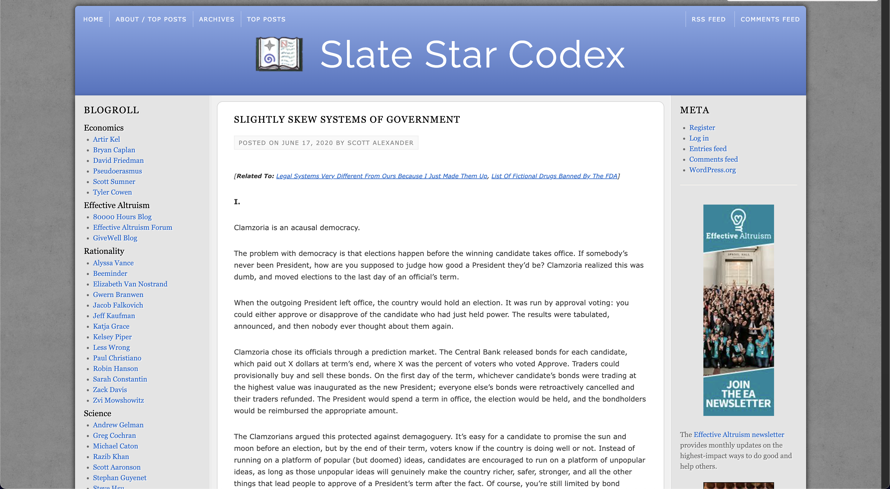
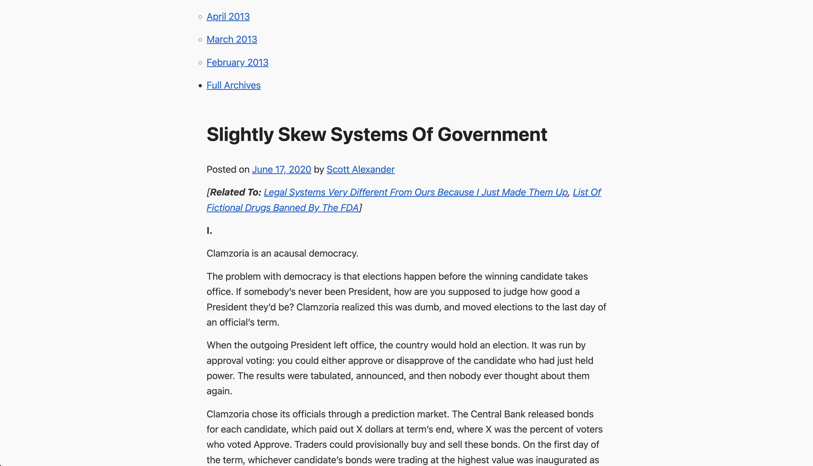

# goodcss

browser extension that replaces outdated css with an easy-to-read css style. click on extension while on web page to activate.

### Installation
1. Download this repository (Code -> Download Zip -> Extract Zip)
2. Open Brave and go to ```brave://extensions```.
3. Enable Developer Mode (toggle in the top-right corner).
4. Click Load Unpacked and select this project folder.

### Example

Before:


After:
